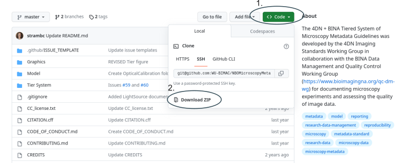
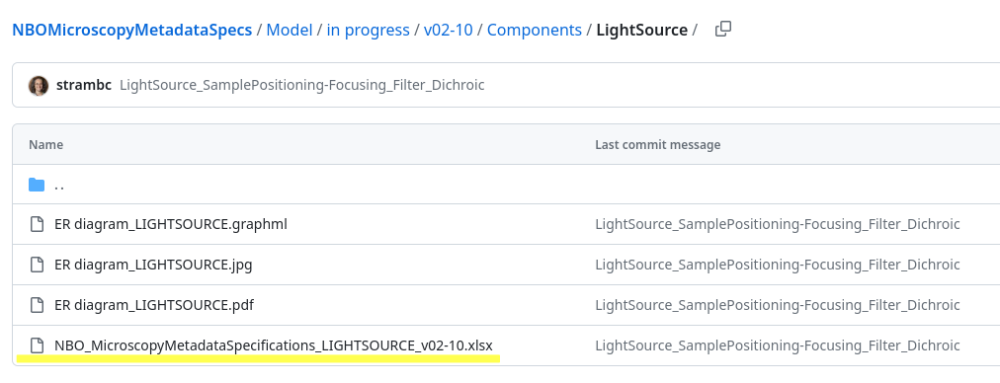

# How to update the XLSX Metadata specification files

The goal of this document is to guide component specific working groups through the update of the XLSX representation of the component's specification.

The objective of this update is to converge towards a first _exhaustive_ specification of the component.

## Proposed working group organisation

You can refer to [Caterina's presentation](https://nextcloud.quarep.org/index.php/apps/onlyoffice/407085?filePath=%2FQUAREP-LiMi%2FWG%207%20Metadtata%2FMeetings%2F2023-06-07%20and%2008_in%20person%20at%20ELMI%2F2023-6-14_NBO-Q%20revision%20plan_CS.pptx)

### Moderator

#### Role Summmary

#### Tasks

### Metadata Curator

#### Role Summmary

#### Tasks

### Community and Industry expert

#### Role Summmary

#### Tasks

### Quarep work group representative

#### Role Summmary

#### Tasks

## Where to find the relevant files

The source for the specification is here:

https://github.com/WU-BIMAC/NBOMicroscopyMetadataSpecs/

You can either clone the repository if you have `git`, with `git clone https://github.com/WU-BIMAC/NBOMicroscopyMetadataSpecs.git` or download a `zip` archive through the `<code>` (1.) and then `download` (2.) buttons

We are interested in the contents of the subdirectories in [Model/in progress/v02-10/Components/](https://github.com/WU-BIMAC/NBOMicroscopyMetadataSpecs/tree/master/Model/in%20progress/v02-10/Components/). For the remainder of this how-to, we will take the [LightSource](https://github.com/WU-BIMAC/NBOMicroscopyMetadataSpecs/tree/master/Model/in%20progress/v02-10/Components/LightSource) directory as an example.

> **Note**
> During this first round of updates the components xlsx file outlined above is the **unique source of truth**

You can refer to the initial view of the specification through the entity-graph (ER) diagrams (preferably in pdf), but these will not be updated automatically.

## Editing the XLSX

You can open the xlsx document locally or on a web service. I am using LibreOffice for this tutorial, some adjustments might be needed.

First thing you'll want to do is adjust the line height (Display -> Lines -> Height) to 5 cm (2 in) so that the whole description fields are legible and there is some breathing space within the table.

### Organisation of the spreadsheet

There are two sheets in the document, the first one concerns hardware parts, and the second the settings.

They correspond to metadata associated to the **Instrument** and the **Image**, respectively.
We focus bellow on the **Instrument** sheet.

#### Spread sheet columns

#### Column descriptions

* `A` **Tier** : Metadata detail level / importance (between 1 and 3)

* `B` **M&M** : Wether this entry should be present in the materials and methods of an article

* Columns `D` through `H` Allow to go "down" the metadata tree hierarchy. Column D, Line 4 is **Instrument**, then `E` is **LightSource-APE**, in `F` are metadata associated with all light sources (e.g. the **model** name). The column `G` is reserved for "families" of light sources (e.g. filament or laser). For each of those families, an array of element are listed in column `H`.
Eventually each element in `H` might have several metadata entries.

Starting from column `K` are the various fields that need to be field for each metadata entry.

> GG: I don't know what APE (in 'lightSource-APE') means

> GG: Explain or delete "subsitution groups" — maybe this is not usefull for the update work

> GG: I don't undestand why column `J` is empty (e.g. why the line 22 is not refered to as `PeakWavelength` in column `J`)

* `K` **Description**: Human readable description of the entry

* `L` **Data type**: Admissible value types (integer, float with unit)

Possible data types are listed [here](TODO link to relevant doc). `enum` types correspond to a limited set of allowed values and must be associated with a corresponding `complex` type.

> GG: is there a unique document with the list of data types? In that case, should it be updated (and how) if a new one is added here?

* `M` **Allowed values** Used for _enum_ data types to specify the set of valid values

* `N` **Complex type** Used for _enum_ data types to indicate the restrained list of allowed values

* `O` **Cardinality/Required?** Each element or entry might be repeated `cardinality` times for a given instance of the instrument metadata. For example, there might be an arbitrary number of `IlluminationWavelengthRange` elements for a given filament lamp, reflecting the multiple peak wavelengths available. In this case cardinality is between 0 and ∞; as the lower value is 0, it is not a required entry. For entries that can appear only one, the corresponding cell in column `O` should either be the letter R or stay empty, wether it is required or not to validate the metadata.

The three remaining columns compare the current specification to the 2016 (latest) [openmicroscopy schema specification](https://www.openmicroscopy.org/Schemas/Documentation/Generated/OME-2016-06/ome.html)

* `R` **OME 6-2016** This cell should indicate `same` if the term is identical, or `was <old term>` if it has changed. An empty cell indicates that the term was added in this specification.

* `S` **OME Cardinality/Required?** Same as column `O` but from the OME spec

* `T` **OME Data type** same as `L` but from the OME spec

* `W` **Name, Lastname, email** This last column is not part of the specification, is intended to input comments and have a contact for those

> GG: I think it should be removed for specification editors

## Suggested update process

### What cannot change

The overall structure of the sheets must not be modified, in particular the column order and the hierarchical organisation from columns D to J. Unless there is a very good reason to do so, the column names should also stay the same, as a change on them would need to be propagated to all the components.

Line `E` (Instrument) should also be kept as is. Entries high in the hierarchy should be updated with care, as entries such as `Manufacturer` or `Model` use a vocabulary shared with the other components. A change here would also need propagation to the other components.

### What can be updated

All the rest of the document can be changed, line by line

* Entries can be edited. This can concern any column. If the enty name is changed, take care to check for the OME 2016 collumns to ease future mappings.

* New entries can be added. For example an "hours used" entry could be added to the Settings sheet to reflect the age of the light source. In this case, all the columns described above must be considered carefully.

### Update workflow

> GG: TODO: did the camera WG go through the tree transversally first to see wether entries were missing, or line by line first to settle the existing entries, and the transversally (and the repeat?). It would be good here to know wether the new versions must be submitted to github, in which case a brief tutorial on how to upload the file and then open a PR / push to main would be welcome (and also say whose role it is). Unforunately we won't have a clean diff for xlsx files, so maybe PRs are useless.
